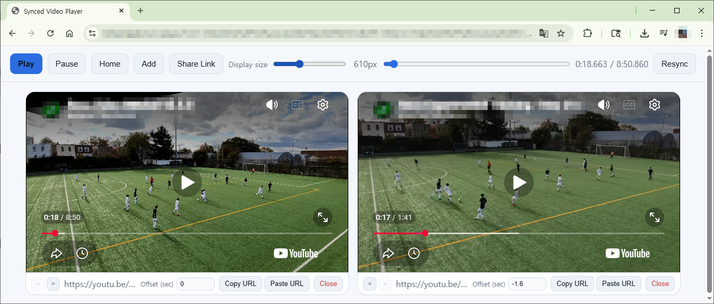

# Synced Video Player

A standalone HTML-based synchronized multi-video player that can play and sync multiple videos simultaneously.

Supports:
- Local video files
- Direct video URLs
- YouTube URLs

No installation required — everything works from a single HTML file.

---


# Screenshot



---

# Features

- Multi-video synchronized playback
- Local video file support (`mp4`, `webm`, etc.)
- Direct video URL support
- YouTube URL support
- Per-video offset adjustment
- Global timeline control
- Synchronized play/pause
- Video card reordering
- Shareable URL generation
- Responsive UI
- Dark mode support

---

# Getting Started

No installation is required.

## 1. Save the File

Example:

```text
synced-video-player.html
```

## 2. Open in Browser

Recommended:
- Google Chrome

Also supported:
- Microsoft Edge
- Firefox

Double-click the file:

```bash
double click synced-video-player.html
```

Or run a local server:

```bash
python -m http.server
```

Then open:

```text
http://localhost:8000
```

---

# Usage

## Add Videos

### Local Files

- Click an empty video area
- Or drag and drop a video file

### Video URLs

Use the `Paste URL` button.

Example:

```text
https://example.com/video.mp4
```

---

## Add YouTube Videos

Supported formats:

```text
https://www.youtube.com/watch?v=xxxx
https://youtu.be/xxxx
```

Paste the URL using the `Paste URL` button.

---

## Playback Controls

Top toolbar buttons:

| Button | Description |
|---|---|
| Play | Play all videos |
| Pause | Pause all videos |
| Home | Jump to beginning |
| Resync | Force synchronization |

---

## Offset Settings

Each video card includes:

```text
Offset (sec)
```

Example values:

| Value | Meaning |
|---|---|
| 1.5 | Start 1.5 seconds later |
| -0.5 | Start 0.5 seconds earlier |

---

## Timeline Control

Use the top timeline slider to seek all videos simultaneously.

---

# Keyboard Shortcuts

| Key | Function |
|---|---|
| Space | Play / Pause |
| Left Arrow | Seek backward 10 seconds |
| Right Arrow | Seek forward 10 seconds |
| Home | Jump to beginning |

---

# Share Link

The Share Link feature generates a URL containing:

- Video source URLs
- Offset values

Local files are NOT included due to browser security restrictions.

Example:

```text
?src1=https://...
&off1=0.5
```

---

# Supported Formats

## Local Files

Any browser-supported format:

- MP4
- WebM
- OGG

---

## Direct Video URLs

The server must allow CORS access.

Example header:

```text
Access-Control-Allow-Origin: *
```

---

## YouTube

Uses the YouTube IFrame API automatically.

---

# Synchronization Method

## Standard Videos

Synchronization is handled using:

- `playbackRate` adjustments
- `currentTime` corrections

## YouTube Videos

Synchronization is handled using:

- periodic `seekTo`
- playback state synchronization

---

# Limitations

## Local Files Cannot Be Shared

Browser security policies prevent local files from being included in shared URLs.

---

## Some URLs May Not Play

If the server blocks CORS access, playback may fail.

---

## YouTube Precision Limitations

YouTube synchronization may be slightly less accurate compared to native HTML5 videos due to IFrame API limitations.

---

# Recommended Environment

- Latest Google Chrome
- Hardware acceleration enabled
- Dedicated GPU recommended for multiple simultaneous videos

---

# Project Structure

Single-file structure:

```text
synced-video-player.html
```

Contains:
- HTML
- CSS
- JavaScript

External dependency:
- YouTube IFrame API only

---

# Customization

## Default Video Card Size

```css
--video-card-size: 360px;
```

---

## Theme Colors

```css
--bg
--panel
--accent
```

---

# Browser Requirements

Required browser features:

- ES6
- CSS Grid
- requestAnimationFrame
- HTML5 Video
- Clipboard API

---

# License

Free for personal and commercial use.

You may modify and distribute it freely.
